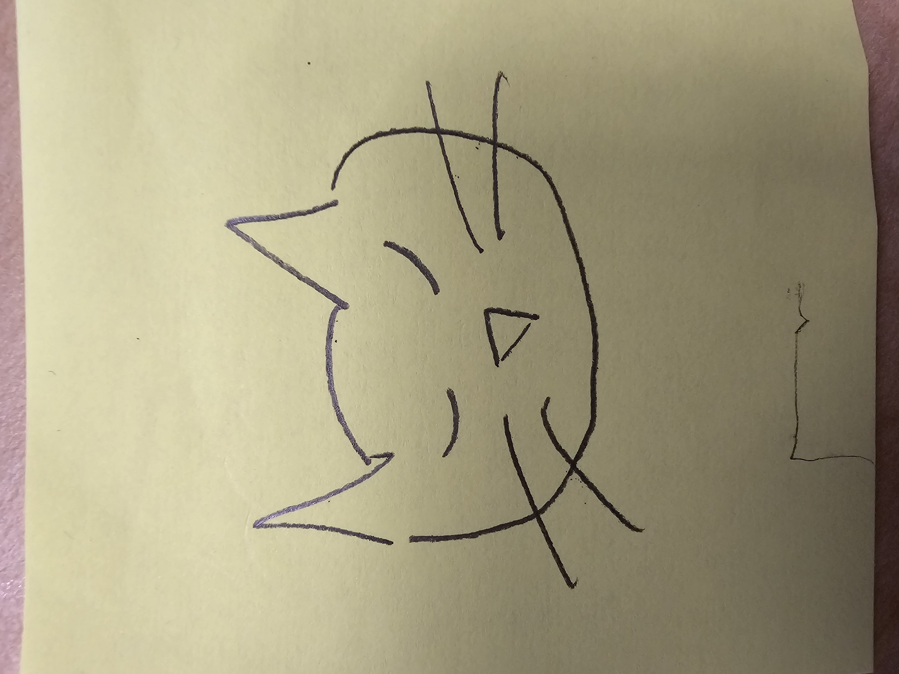

# Requirements

* Black and white drawing with turtle graphics
* At least 2 variables
    * When you change the variable, the picture changes accordingly
    * Your variable can take a range of values.
    * In the comments, you specify what values the variable can take.
* At least 2 for loops
    * At least one of the for loops uses the loop variable to do something slightly different each time it loops through.
* At least 2 functions
    * Each function is called at least 2 times in your code
    * At least one function has a parameter, and at least two different arguments are supplied to that function

See `rubric.md` for grading rubric.

# Milestones

1. Complete the "Project Proposal" questions below.
2. Rough Draft (earn at least 20 of the 30 possible points)
3. Colleage Consultation (in-class activity with corresponding Google Doc)
4. Final Draft
5. Presentation

# Project Proposal

1. Roughly, what will your drawing look like

2. What are two variables you could use so that when you change each variable, the drawing changes?

3. Where is there repetition in your drawing?

4. What are the main parts of your drawing? Are there clear sections or objects?

5. How could you use a loop variable of a for loop? Is there somewhere in your drawing where something is repeated, but it's slightly different each time? Maybe the same object is repeated in different places, or maybe a similar object is repeated but with different sizes?

6. Sketch your image, take a picture, and add it here!

